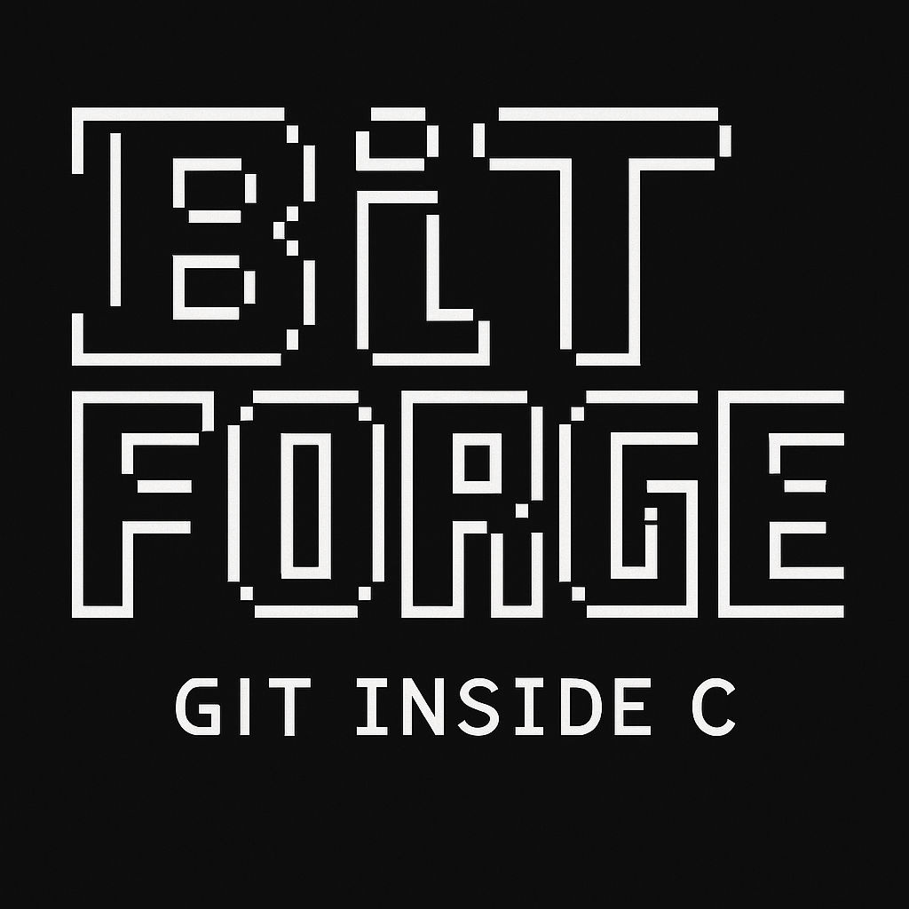

# ⚙️ BitForge




> Um Git minimalista, escrito do zero em C.  
> Para quem quer entender o Git por dentro, byte por byte.

---

## 🚀 Sobre o projeto

**BitForge** é uma recriação leve e simplificada do Git, feita em linguagem C.  
Ele mostra como o Git funciona nos bastidores — criando blobs, commits e controlando versões sem magia.

---

## 📦 Funcionalidades

- `bitforge init` — Inicializa um repositório `.git/`
- `bitforge add <arquivo>` — Cria um blob com hash SHA-1 do conteúdo
- `bitforge commit -m "<mensagem>"` — Cria um commit que referencia o blob
- (em breve) `bitforge log` — Visualiza o histórico de commits

---

## 🧠 Conceitos explorados

- Estrutura interna do Git (`.git/objects`, `HEAD`, `refs`)
- Hashing com SHA-1 (`openssl`) (pending)
- Compressão de objetos (`zlib`) (pending)
- Manipulação direta de arquivos binários (pending)
- Design minimalista e performático (pending)

---

## 🧪 Como compilar

```bash
sudo apt install libssl-dev zlib1g-dev
gcc mygit-init.c -o bitforge-init -lssl -lcrypto -lz
gcc mygit-add.c -o bitforge-add -lssl -lcrypto -lz
gcc mygit-commit.c -o bitforge-commit -lssl -lcrypto -lz
gcc mygit-log.c -o bitforge-log -lssl -lcrypto -lz
```

## 🛠️ Como usar

```aiignore
./bitforge-init
./bitforge-add hello.txt
./bitforge-commit -m "Primeiro commit no universo BitForge"

```

## 🧩 Por que usar?
Porque entender o Git de verdade significa ver o que acontece sem o “por trás das cortinas”.
BitForge é o playground perfeito para isso. Use, hackeie, quebre — e aprenda.

## 📚 Referências
- Pro Git Book
- Git Internals
- Código-fonte original do Git (em C)

## ⚡ Licença
MIT. Faça o que quiser. Só não diga que foi fácil. 😄

## 👨‍💻 Autor
Feito por alguém que curte C, versões, e um bom desafio.
